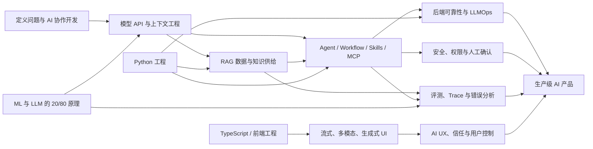

# AI 迭代这么快，前端还值得学什么

前端团队内部分享稿 · 调研校准日期：2026-09-06

> 一句话结论：不要赌某个模型、框架或提示词技巧能活多久，要投资“定义问题—给足上下文—连接数据和工具—评测结果—可靠交付—让人可控”这条完整链路。

## 一、背景

### 1. 这次分享想解决的不是“该追哪个模型”

一个月前，我们做了一个“前端 → AI 转型工作台”。当时的问题是：AI 迭代太快，现在学的东西会不会很快白学？一个月后再看，模型能力确实又往前走了，但更值得警惕的不是某项知识过期，而是我们把大量时间花在了错误的颗粒度上。

- 容易过期：模型榜单、提示词“魔法句”、某个框架的 API 写法、照教程拼出来的 Demo。
- 不容易过期：问题定义、输入输出契约、工程基础、数据质量、评测、可靠性、安全、交互判断和业务取舍。

所以这次不靠感觉更新路线，而是重新查三类证据：当前模型能力和使用数据、北京可访问的真实 JD、可回到原文的面经。

### 2. AI 已经能写更多代码，但“能生成”不等于“能交付”

几个信号放在一起看，比单看发布会更接近现实：

- Anthropic 对 50 万次编程相关交互的研究中，Claude Code 样本里约 79% 被归为“自动化”，JavaScript、HTML 和 UI/UX 类任务很常见。这说明简单页面和局部实现会更快被压价。[Anthropic Economic Index](https://www.anthropic.com/research/impact-software-development)
- Stack Overflow 2025 调查覆盖 49,009 名开发者：对 AI 输出“不信任”的比例高于“信任”；66% 的开发者遇到过“几乎正确但不完全正确”的答案，45% 认为调试 AI 代码更费时。AI 有用，但验证负担真实存在。[AI 调查](https://survey.stackoverflow.co/2025/ai) · [调查方法](https://survey.stackoverflow.co/2025/methodology)
- METR 的软件任务时长研究显示，前沿模型能独立完成的任务跨度正在指数增长；但研究团队也提醒，基准正在接近饱和，真实项目更脏、更模糊，不能把实验结果直接等同于“能接管一个团队”。[METR Time Horizons](https://metr.org/time-horizons/) · [2026 Frontier Risk Report](https://metr.org/blog/2026-05-19-frontier-risk-report/)
- OpenAI 对 Agent 使用的抽样分析显示，用户正在把更长的任务交给 Agent；文中估算 80.6% 的抽样个人用户至少发起过一次预计需要 30 分钟以上的任务。不过这是模型估算和抽样数据，适合看方向，不适合当精确劳动生产率。[How agents are transforming work](https://openai.com/index/how-agents-are-transforming-work/)
- GitHub 观察到 TypeScript 在 2025 年成为平台使用最多的语言，并把类型系统解释为 AI 代码时代的一种护栏；Python 位居第二。这个数据说明前端旧能力没有清零，类型化工程和 Python 生态正在汇合。[GitHub Octoverse 2025](https://github.blog/news-insights/octoverse/octoverse-a-new-developer-joins-github-every-second-as-ai-leads-typescript-to-1/)

这几条并不矛盾：模型可以独立完成越来越长的实现，但需求是否说清、上下文是否正确、结果是否通过真实验证，仍然由工程系统和人负责。

### 3. 行业大佬的预测应该怎么听

预测不是事实，只能当“方向假设”。把几家厂商的表述交叉后，比较稳定的共识是：

- 开发者从“亲手写每一行”转向“理解、指导、验证”。[GitHub：The new identity of a developer](https://github.blog/news-insights/octoverse/the-new-identity-of-a-developer-what-changes-and-what-doesnt-in-the-ai-era/)
- 当生成更便宜，人的判断、品味、权衡、照顾真实用户和承担责任会更重要。[OpenAI：Built to benefit everyone](https://openai.com/index/built-to-benefit-everyone-our-plan/)
- Agent 系统不要一上来就堆复杂框架和多智能体。先用最简单架构做出可评测结果，工具设计与失败处理通常比角色数量重要。[Anthropic：Building effective agents](https://www.anthropic.com/engineering/building-effective-agents)
- 提示工程正在升级为上下文工程：不只是写指令，还要管理系统信息、工具、外部数据、历史和 token 预算。[Anthropic：Effective context engineering](https://www.anthropic.com/engineering/effective-context-engineering-for-ai-agents)

这些公司都可能有推广自身产品的利益，因此我们不会只用“大佬说了”排学习优先级。真正落表时，还要通过 JD 和面经复核。

### 4. 我们怎样从真实 JD 和面经反推学习内容

网站采用四步法：

1. **收 JD**：优先招聘官网的具体职位详情，保留职位 ID、发布日期、核验日期和原链接。
2. **抽能力**：把“RAG”“Agent”拆成可验证能力，例如检索评测、工具契约、状态恢复、权限和成本。
3. **看面经**：用 50 个可溯源链接统计主题覆盖度，区分真实面经和题单汇总。
4. **变练习**：把能力映射到面试问题、结构化参考答案、闪卡、脑图和专项任务。

本轮北京 JD 抽样里，出现得很集中的是：Python、模型 API、RAG、Agent、工具、评测、系统设计、稳定性与安全。比如：

- 百度 J100679 同时要求推理服务、工具链、数据管道、RAG、Agent、Python、API、Docker/K8s 和稳定性优化。[官方 JD](https://talent.baidu.com/jobs/detail/GRADUATE/66a12645-f0f1-435c-8426-9fb91f1be330)
- 百度 J103341 明确做 API、CLI、Skill 全链路工具和 Agent-friendly 基础设施，强调系统设计、抽象和工程基本功。[官方 JD](https://talent.baidu.com/jobs/detail/SOCIAL/a5ff8d15-b547-4a87-ba55-a128dae953cd)
- 百度 J101017 覆盖 ReAct、Plan-execute、工具、记忆、多 Agent 和评测体系。[官方 JD](https://talent.baidu.com/jobs/detail/GRADUATE/02f73086-be71-4d09-8d6e-f1c6981b8b48)
- 百度 J102217 同时覆盖模型训练、应用、评测、RAG、Agent 和多模态，说明训练深度更适合算法岗，而不是所有应用岗的统一起点。[官方 JD](https://talent.baidu.com/jobs/detail/SOCIAL/f16d38a1-440b-4e7b-b09b-ddfdfaf643e4)

面经也在验证同一件事：应用岗会深挖 RAG 质量、工具容错、上下文、生产问题和项目价值；平台岗更看框架状态、协议和系统设计；算法岗才明显增加训练与模型深度。[腾讯 / 百度面经汇总](https://www.nowcoder.com/discuss/878600528970735616) · [2026 应用岗位复盘](https://www.nowcoder.com/discuss/914178628659707904) · [Agent 岗位分层复盘](https://www.nowcoder.com/discuss/916347378695692288)

限制也要说清：当前精确 JD 以可稳定访问的百度官方职位为主，不能代表北京全部市场；招聘雷达里的 100 组公司 × 岗位组合只是官网核验入口，不是 100 个独立在招职位；面经是自述样本，题目频次表示“多少来源覆盖这个主题”，不是逐字题目出现次数。

## 二、值得学习的内容知识图谱

### 1. 先看全图



这张图里，框架名字很少。原因是我们要学的是连接关系和失败边界，而不是把路线绑死在一个 SDK 上。

### 2. 核心投入：现在就值得花时间

| 知识块 | 为什么仍值得 | 学到什么程度算够用 | 建议产出 |
|---|---|---|---|
| AI 协作开发、规格与验证 | Agent 能做更长任务后，瓶颈转向任务定义、仓库上下文和验证 | 会写目标 / 非目标 / 验收标准；会让 Agent 先读后计划；会审 diff、跑测试、回滚 | 一份可执行任务包 + 审查记录 |
| Python 工程 | 模型、数据、评测和服务生态的共同语言 | 类型、包管理、pytest、asyncio、FastAPI、超时重试 | 一个可测试的异步模型网关 |
| 模型 API 与上下文工程 | 模型会换，输入契约、工具说明、结构化输出和上下文生命周期仍在 | JSON Schema、上下文选择 / 压缩、缓存、模型路由、失败重试 | 10 条固定评测集 + 版本记录 |
| RAG 数据与知识供给 | 企业应用仍需要可更新、可引用、受权限控制的知识 | 解析、切分、混合检索、重排、引用、权限、增量索引、分层评测 | 可定位失败层的 RAG Demo |
| Agent / Workflow / Skills / MCP | JD 已从“聊天”转到能调用工具和完成流程 | 工具契约、状态、预算、检查点、幂等、人工确认、MCP 授权原则 | 一个可恢复、可审计的 Agent |
| 评测、Trace 与错误分析 | 模型升级快，没有固定基线就不知道是不是变好 | 黄金集、grader、trace、错误分类、质量 / 延迟 / 成本门槛 | 自动回归报告 |
| AI UI | 简单页面更容易生成，但长任务、流式、多模态和可视化仍难 | Streams / SSE、Abort、分片解析、状态协议、性能、生成式 UI 白名单 | 可取消、可恢复的流式界面 |
| AI UX 与产品判断 | AI 不确定且会执行动作，是否让人理解和控制决定能否上线 | 预期管理、证据、可撤销、高风险确认、失败恢复、行为指标 | 五状态交互原型 |
| 后端可靠性 | Agent 拉长了调用链，超时、重试、成本和副作用都会放大 | 队列、限流、熔断、幂等、补偿、检查点、容量预算 | Agent 失败处理表 |
| 安全与隐私 | 工具调用把“说错话”升级成“做错事” | Prompt 注入、最小权限、沙箱、确认、审计、回滚、密钥管理 | 威胁模型 + 10 条攻击回归 |
| LLMOps | 多模型和快速版本要求可复现、可观测、可回滚 | 模型 / Prompt / 数据版本、灰度、SLO、成本归因 | 发布清单 + Trace 看板 |

安全不是“以后上线再补”。OWASP 2026 Agentic Top 10 已把自主 Agent 的身份、权限、工具滥用和级联失败单独列为风险；MCP 的授权规范也说明，协议接入与权限治理必须一起学。[OWASP Agentic Top 10](https://genai.owasp.org/resource/owasp-top-10-for-agentic-applications-for-2026/) · [MCP Authorization](https://modelcontextprotocol.io/specification/2025-11-25/basic/authorization)

### 3. 继续学习，但只拿 20/80

**机器学习与统计直觉**：掌握训练 / 验证 / 测试、过拟合、数据泄漏、Precision / Recall / F1、实验设计和误差分析。应用岗的目标不是先推完整公式，而是能判断数据和指标有没有骗你。

**LLM / Transformer 原理**：掌握 token、embedding、attention 的直觉、上下文窗口、采样、KV Cache、训练 / SFT / 对齐的区别。能把原理连接到质量、延迟、显存和成本即可。除非投算法岗，不要把“从头复现训练”当转型起点。

Stanford AI Index 2026 显示编码基准提升很快，一些基准接近饱和；这反而说明应该理解指标边界和真实评测，而不是背某个模型在某张榜单上的分数。[Stanford AI Index 2026](https://hai.stanford.edu/assets/files/ai_index_report_2026.pdf)

### 4. 按岗位选学

**微调、训练和开源模型部署**：投算法、模型平台、私有化或成本极度敏感岗位时深学；应用岗先做 Prompt / RAG / 基座升级的对照实验。如果没有可靠数据、评测集和明确收益，微调很容易变成昂贵的自我感动。

**Next.js 和特定现代全栈框架**：Server / Client 边界、缓存和服务端安全值得理解，但 Next.js 不是 AI 门票。团队用 Vue、Node、Go 或其他栈，同样可以做 AI 应用。把时间投给目标岗位真实使用的栈。

**高级多模态管线、WebGL、GPU 推理**：对 AI 体验、多模态应用和创意工具岗位很有价值；其他方向先了解输入输出、时延和成本边界。

### 5. 降低优先级，不等于永远不碰

| 暂不单独投入 | 为什么 | 换成什么 |
|---|---|---|
| 提示词魔法句式 | 随模型变化、难复现 | 上下文工程 + 结构化输出 + 固定评测 |
| 背 LangChain / LangGraph / SDK API | 版本变化快 | 状态、工具契约、检查点、恢复等原理 |
| 朴素 RAG Demo | 区分度很低 | 数据治理 + 混合检索 + 引用 + 分层评测 |
| 多 Agent 炫技 | 协调成本和失败面更大 | 先用确定性 Workflow 或单 Agent |
| 把 Next.js 当 AI 前置课 | 与多数 AI 核心能力不等价 | 按 JD 选栈，先补 Python / 评测 / 可靠性 |
| 每日追模型榜单 | 很容易把资讯消费当学习 | 每月做一次能力实测和基线更新 |

### 6. 给前端团队的 12 周务实路线

- 第 1—2 周：把现有开发任务改造成 AI 协作流程；练规格、计划、diff 审查、测试和回滚。
- 第 3—4 周：补 Python、FastAPI、asyncio，做一个有超时、重试和日志的模型 API。
- 第 5—6 周：做上下文工程与结构化输出，用固定 20 条样本做回归。
- 第 7—8 周：做一个可引用 RAG，能区分检索失败和生成失败。
- 第 9—10 周：给 RAG 加工具调用、状态、人工确认、幂等和恢复。
- 第 11 周：补流式 UI、长任务状态、证据展示、撤销与错误恢复。
- 第 12 周：做评测、Trace、安全回归和一次完整项目复盘。

每两周只交一个可演示、可测量的小产出。不要同时开五门课。

## 三、网站开源项目

### 1. 网站不是课程目录，而是学习闭环

项目目前分为四条主线：

- **学习路线**：能按重要度、难度、天数和最新判断排序；每块知识有入门、进阶、精通边界与中英文资源。
- **岗位机会**：精确 JD 与官方招聘检索分层，能回到招聘官网核验，不用虚构职位充数量。
- **面试训练**：从 50 个来源归纳高频问题，给出考察目的、结构化 / 整段参考答案，支持语音回答、模型评分、历史快照和分数曲线。
- **刻意练习**：每个知识块都有低中高难度闪卡、脑图和可提交的专项任务。

核心闭环是：

```text
JD 告诉我们企业愿意为什么能力付钱
面经告诉我们企业怎样验证这项能力
行业研究告诉我们这项能力会不会快速折旧
训练工具帮助用户把“知道”变成“能回答、能做、能复盘”
```

### 2. 开源前已做的整理

- 保留现有 Git 历史，没有重建仓库。
- 增加 MIT License、贡献说明、环境变量示例和真实项目 README。
- 把 2026-09 的学习判断写回网站：核心投入、继续学习、按岗位选学。
- 增加 AI 协作开发知识块、6 条资源、6 张闪卡和一个专项任务。
- 更新北京精确 JD 样本和 2026 年 8 月面经来源。
- 明确数据口径：招聘雷达不是独立 JD，薪资未公开就不猜，面经频次是来源覆盖度。
- DeepSeek API Key 只在服务端环境变量读取；仓库不包含真实 Key。

### 3. 适合团队一起维护的地方

这个项目不应该由一个人长期“拍脑袋更新”。开源后可以把维护拆成几类简单贡献：

- 每月核验失效 JD 和新增岗位；
- 给面经补来源、日期和岗位类型；
- 给知识块提交更好的中英文资源；
- 把真实项目事故改造成闪卡和专项任务；
- 用不同模型跑同一组题，提交评测基线；
- 改进无障碍、移动端、语音识别和数据导入导出。

### 4. 演示建议

现场不要从首页讲功能列表，可以直接走一条真实路径：

1. 在“学习路线”筛选“核心投入”，打开“Agent / Workflow”看本轮判断依据。
2. 跳到“岗位机会”，打开一个精确 JD，说明职位 ID、日期和来源层级。
3. 在“面试训练”按热度选题，展示题目目的，口述 60 秒并评分。
4. 打开回答历史看分数曲线，再把薄弱项送到“刻意练习”。
5. 用脑图说明这不是知识清单，而是一条从能力到生产交付的依赖关系。

### 5. 最后的判断

“AI 迭代太快，学了也白学”只对一半。追逐模型名称、框架 API 和花哨 Demo，确实很容易过期；但 AI 越强，定义目标、组织上下文、连接真实数据、验证结果、控制风险和做好体验反而越重要。

前端开发者的优势没有消失。我们天然靠近用户、交互、状态、性能和产品细节。要补的不是一套“AI 黑话”，而是 Python 与服务端、数据与检索、Agent 可靠性、评测和安全。把两边接起来，才是最现实的转型路径。
